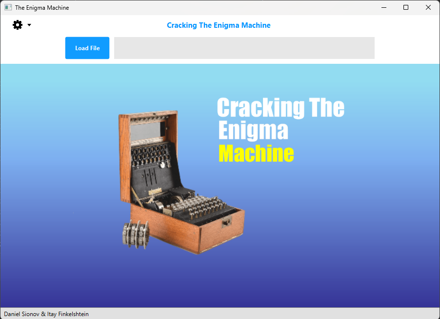
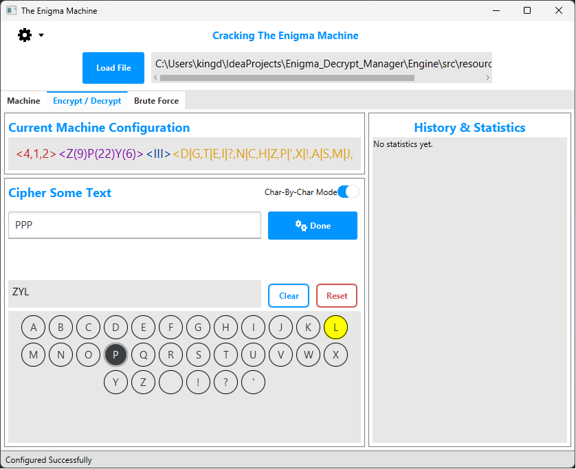
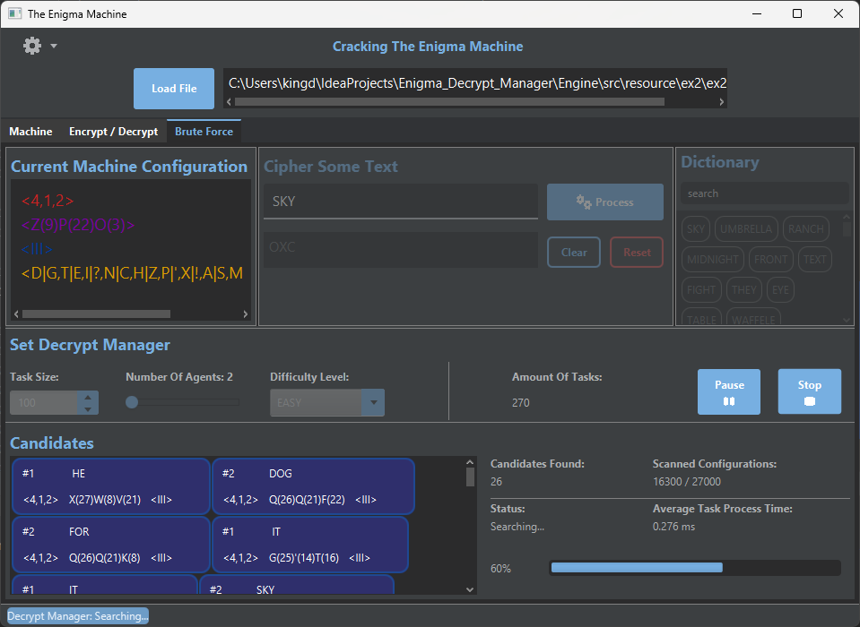

# Enigma Decrypt Manager

##### In this project, we built a Desktop application using javaFX. The application describes extensive usage options in a virtual Enigma machine, which include:
1. Loading of various Enigma machines based on XML files.
2. Configuring your own machine configuration.
3. Encryption and decryption of messages with the help of the Enigma machine.
4. Saving history of ciphered text. 
5. Automatic brute-force decoding mode.

This project is a direct continuation of the project [Virtual Enigma Machine](https://github.com/Danielsio/Virtual_Enigma_Machine)

## UI Images

